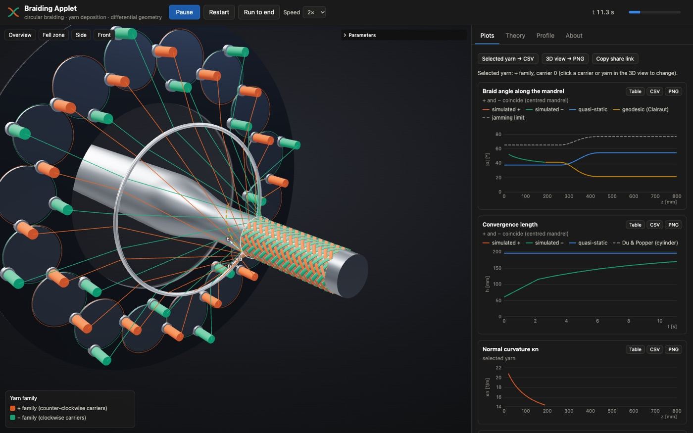
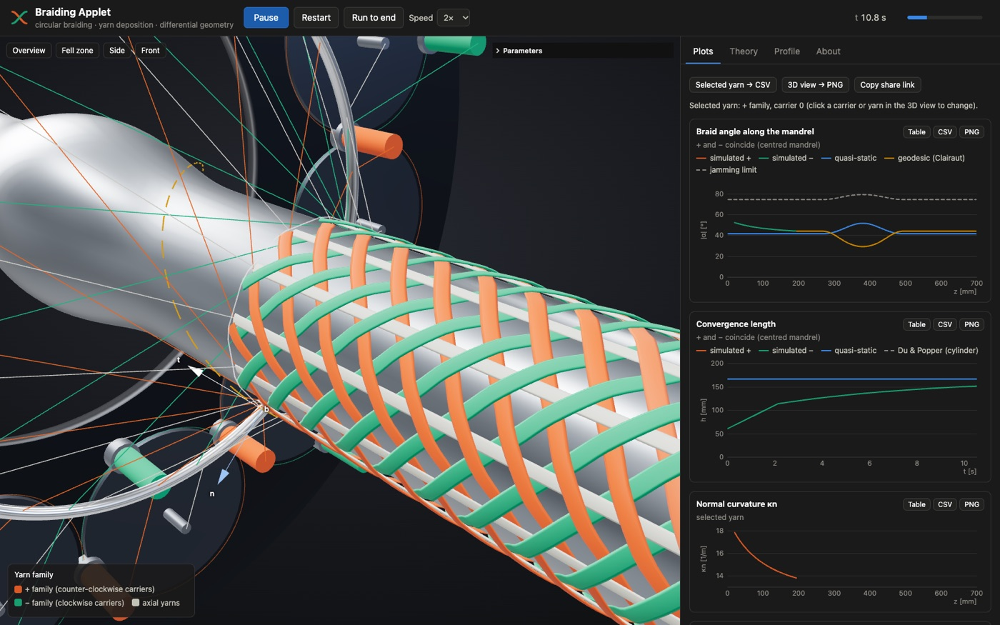
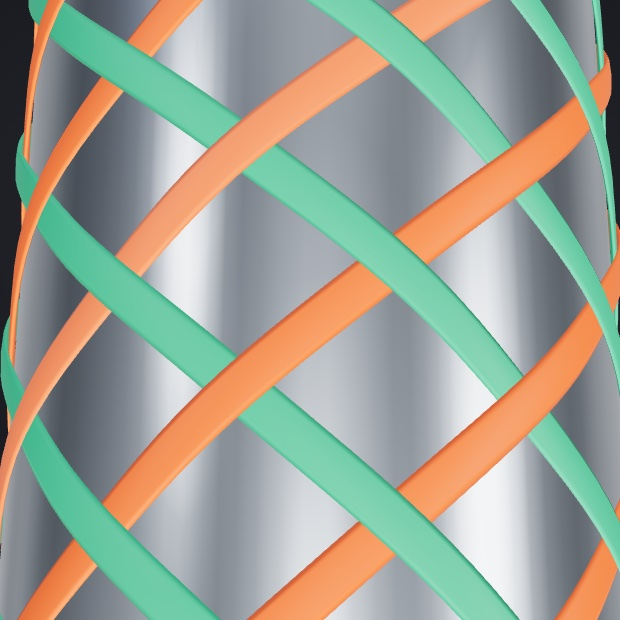
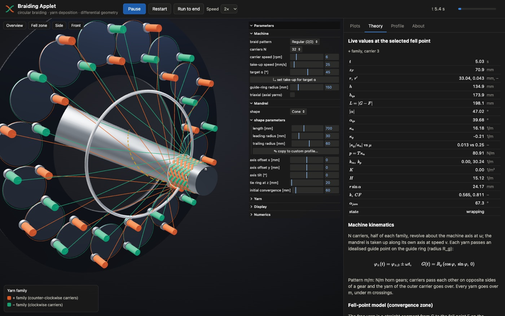

# Braiding Applet

**An interactive 3D explorer of circular braiding.** It shows how an idealised maypole braiding
machine lays yarns onto a mandrel, and how the yarn paths relate to the differential geometry of
the mandrel and the mechanics of the yarns.

**▶ Live: https://vaitkusm.github.io/braiding-applet/**



## What it does

- **Machine.** $N$ carriers on a figure-eight horn-gear track and a guide ring. Braid patterns are
  diamond 1/1, regular 2/2 and Hercules 3/3, optionally triaxial (axial yarns).
- **Mandrel.**
  - Shapes: cylinder, cone, cylinder–taper–cylinder, bulge ($K>0$), hourglass waist ($K<0$), or a
    free-form profile drawn in the built-in editor.
  - The mandrel can be offset or tilted relative to the machine axis.
- **Yarn deposition.** The fell-point (convergence-zone) model of Kessels & Akkerman:
  - each free yarn is straight and leaves the mandrel tangentially at its fell point;
  - it is solved with unilateral contact and a second-order scheme;
  - bridging over concave regions and catching on obstacles are included.
- **Differential geometry.** Braid angle from the meridian; normal and geodesic curvature of every
  deposited yarn in closed form; the Darboux frame; Gaussian and mean curvature of the mandrel; the
  geodesic (Clairaut) reference.
- **Physics.**
  - Quasi-static braid angle and convergence length, and the Du & Popper transient.
  - Contact pressure $p=T\kappa_n$ and the slip criterion $|\kappa_g|\le\mu\kappa_n$.
  - Cover factor and jamming.
- **Interlacing.** Crossings are detected on the mandrel, and over/under is decided by the carriers'
  horn-gear sides. The rendered undulation follows from this.
- **Analysis.**
  - Live plots of braid angle, convergence length, curvatures, slip ratio and cover factor.
  - A theory panel with formulas and live values.
  - Colour modes, CSV/PNG export, and share links (all parameters are kept in the URL).

| Fell zone (triaxial braid on a bulge)   | Interlacing (diamond 1/1)                   |
| --------------------------------------- | ------------------------------------------- |
|  |  |



## Run locally

No build step: the page is plain ES modules. Dependencies (three.js, lil-gui, KaTeX) load from
jsDelivr through an import map.

```sh
deno task serve            # → http://127.0.0.1:8000/
# or: python3 -m http.server 8000
```

## Development

The tooling uses [Deno](https://deno.com) 2.6. There is no Node.

```sh
deno task check            # lint + format check + unit tests (as in CI)
deno task test             # unit tests of the physics core
deno task smoke            # headless-Chrome end-to-end test + screenshots (needs `deno task serve`)
```

The physics core (`src/core/`) is pure JavaScript and is tested against:

- analytic solutions (the steady state and Du & Popper transient on a cylinder);
- an independent SciPy solution on a curved mandrel, where the scheme shows second-order convergence;
- finite-difference checks of the closed-form curvatures;
- symmetry and interlacing invariants.

Every push to `main` runs these checks and deploys the site to GitHub Pages.

## Documentation

- [`docs/THEORY.md`](docs/THEORY.md): model, derivations, conventions, validation, limitations,
  references.
- [`docs/ARCHITECTURE.md`](docs/ARCHITECTURE.md): module map, data flow, how to extend.
- [`AGENTS.md`](AGENTS.md): conventions and invariants for contributors and AI agents.
- [`docs/PLAN.md`](docs/PLAN.md): the original implementation plan.

## License

MIT; see [LICENSE](LICENSE).
