# Theory: circular braiding onto a mandrel

This document explains the model behind the applet and derives everything it computes. It assumes the
classical differential geometry of surfaces (first and second fundamental forms, normal and geodesic
curvature, the Darboux frame). The emphasis is on the braiding process and on the modelling steps
that turn the machine's motion into the geometry of the laid yarns.

Code comments refer to the section numbers. All figures are computed with the applet's own core by
`tools/figures/make.js` (see [About the figures](#about-the-figures)).

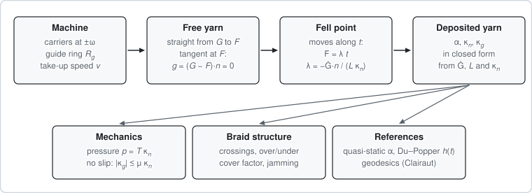

**Figure 0.** How the model is organised. The machine moves the guide points; the straight free
yarn and a unilateral contact condition move the fell point; the geometry of the deposited yarn then
follows in closed form. Mechanics, braid structure and the reference solutions are computed from it.

**Roadmap.**

| Section | Question it answers                                                    |
| ------- | ---------------------------------------------------------------------- |
| 1       | Which frames, signs and angle conventions are used?                    |
| 2       | What does a circular braiding machine do?                              |
| 3       | How is a yarn laid onto the mandrel? (the fell-point model)            |
| 4       | Which braid angle and convergence length result, and how fast?         |
| 5       | What curvature does a yarn feel, and where can it not lie on the part? |
| 6       | How do braided yarns differ from geodesics?                            |
| 7       | When does friction hold a laid yarn in place?                          |
| 8       | How do the yarns interlace?                                            |
| 9       | How well does the braid cover the mandrel, and when does it jam?       |
| 10–11   | How is the implementation validated, and what is idealised?            |

**Notation.**

| Symbol                 | Meaning                                                                |
| ---------------------- | ---------------------------------------------------------------------- |
| $N$, $m$               | carrier count; pattern $m/m$ (1 diamond, 2 regular, 3 Hercules)        |
| $\omega$, $v$          | carrier revolution rate about the machine axis; take-up speed          |
| $R_g$                  | guide-ring radius                                                      |
| $r(z)$                 | mandrel profile (radius as a function of the axial coordinate)         |
| $G$, $F$, $L$          | guide point, fell point, free length $L=\lvert G-F\rvert$              |
| $t$, $n$, $b$          | Darboux frame at $F$: yarn tangent, outward normal, $b=n\times t$      |
| $\kappa_n$, $\kappa_g$ | normal and geodesic curvature of the laid yarn (convex-positive)       |
| $k_m$, $k_p$, $K$, $H$ | principal curvatures (meridian, parallel), Gaussian and mean curvature |
| $\alpha$, $\beta$, $h$ | braid angle, lag angle, convergence length                             |
| $w$, $T$, $\mu$        | yarn width, yarn tension, yarn–mandrel friction coefficient            |

**Reference case.** Several figures use a cylinder of radius $r=40$ mm in a machine with $N=16$
carriers, $R_g=150$ mm, $\omega=1$ rad/s and $v=40$ mm/s. Then $\tan\alpha=\omega r/v=1$, so
$\alpha=45°$, and the formulas below give the lag angle $\beta=\arccos(r/R_g)=74.53°$, the
convergence length $h_\infty=\sqrt{R_g^2-r^2}/\tan\alpha=144.57$ mm and the relaxation time
$\tau=\sqrt{R_g^2-r^2}/(\omega r)=3.614$ s. The other figures use the applet's default taper.

## 1. Conventions

This block is repeated verbatim in `src/core/surface.js`.

- **Machine frame** (fixed): machine axis $z$, guide-ring plane $z=0$. Carriers revolve about $+z$.
  The braid forms downstream ($z<0$, towards the take-up). $\omega$ is the carriers' revolution rate
  about the machine axis, not the horn-gear speed.
- **Mandrel frame** (moves with the mandrel): axis $z_M$, measured from the leading end (braided
  first). The mandrel is a surface of revolution
  $$S(z,\theta)=(r\cos\theta,\ r\sin\theta,\ z),\qquad S_z=(r'\cos\theta,\ r'\sin\theta,\ 1),\qquad S_\theta=(-r\sin\theta,\ r\cos\theta,\ 0).$$
- **Outward unit normal** $n=\dfrac{S_\theta\times S_z}{|S_\theta\times S_z|}=\dfrac{(\cos\theta,\ \sin\theta,\ -r')}{\sqrt{1+r'^2}}$.
  The chart $(z,\theta)$ is therefore _left-handed_ with respect to $n$.
- **First fundamental form**: $g_{zz}=1+r'^2$, $g_{z\theta}=0$, $g_{\theta\theta}=r^2$.
- **Second fundamental form** with respect to the outward $n$ ($`\mathrm{II}_{ij}=S_{ij}\cdot n`$):
  $ii_{zz}=r''/\sqrt{1+r'^2}$, $ii_{z\theta}=0$, $ii_{\theta\theta}=-r/\sqrt{1+r'^2}$.
- **Curvatures are convex-positive**: a convex body has positive curvatures.
  $$\kappa_n(t)=-\frac{\mathrm{II}(t,t)}{\mathrm{I}(t,t)},\quad k_m=-\frac{r''}{(1+r'^2)^{3/2}},\quad k_p=\frac{1}{r\sqrt{1+r'^2}},\quad K=k_mk_p=-\frac{r''}{r(1+r'^2)^2},\quad H=\tfrac12(k_m+k_p).$$
- **Euler's formula**: $\kappa_n=k_m\cos^2\psi+k_p\sin^2\psi$, where $\psi$ is the angle between $t$
  and the meridian.
- **Braid angle** $\alpha$: signed angle in the tangent plane from the meridian $m=S_z/|S_z|$ towards
  the parallel $e=S_\theta/|S_\theta|$, i.e. $\alpha=\mathrm{atan2}(t\cdot e,\ t\cdot m)$. On a
  cylinder this is the usual angle to the axis. On sloped profiles the angle to the machine axis is
  different: $\cos\alpha_{3D}=\cos\alpha/\sqrt{1+r'^2}$.
- **Darboux frame** of a curve on the surface: $(t,n,b)$ with $b=n\times t$, geodesic curvature
  $\kappa_g=t'\cdot b$, and $t'=\kappa_g\,b-\kappa_n\,n$ (with $\kappa_n$ convex-positive).
- The code writes `g_zz, g_tt, ii_zz, ii_tt` instead of $E,F,G,L,M,N$. Those letters would clash with
  the guide point $G$, the free length $L$ and the carrier count $N$.

## 2. The braiding process

### 2.1 Machine and convergence zone

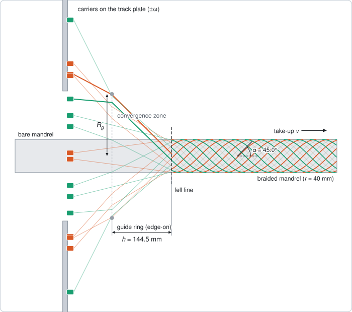

**Figure 1.** The reference case in side view, computed at $t=25$ s. Yarns run from the bobbin
carriers through the guide ring to the mandrel; the back half of the braid is drawn faint.

A circular (maypole) braiding machine has $N$ bobbin carriers on a track plate. Half of them revolve
counter-clockwise, half clockwise, and each weaves in and out of the other family along a
serpentine track (Section 8). Every yarn is led through a **guide ring** of radius $R_g$ onto the
**mandrel**, which is pulled through the machine along its axis at the **take-up speed** $v$.

Between the ring and the mandrel the yarns are **free**. They meet the mandrel along the **fell
line**, where the braid forms. The axial distance from the ring plane to the fell line is the
**convergence length** $h$; the region in between is the **convergence zone**.

The braid angle comes from the ratio of rotation to take-up. While the mandrel advances by $v\,dt$,
each carrier turns by $\omega\,dt$, an arc $\omega r\,dt$ at the mandrel radius. Faster rotation
raises the braid angle towards hoop winding; faster take-up lowers it towards the axis (Section 4).

### 2.2 Carrier kinematics

Carriers of the two families move with uniform angular speed:
$$\varphi_{+,j}(t)=j\Delta+\omega t,\qquad \varphi_{-,i}(t)=i\Delta+\tfrac{\Delta}{2}-\omega t,\qquad \Delta=\frac{4\pi}{N}.$$

The deposition model uses the idealised guide point $G=R_g(\cos\varphi,\sin\varphi,0)$ of each yarn
on the guide ring. Carrier $+j$ and carrier $-i$ are at the same azimuth ("pass") when
$2\omega t=(i-j)\Delta+\Delta/2+2\pi p$. This happens every $\pi/\omega$ seconds, at the azimuths
$\frac{2\pi}{N}(k+\frac12)$. These are $N$ fixed passing points; Section 8 shows how the track turns
each passing into a crossing with a definite over/under.

### 2.3 Mandrel pose and relative motion

The model works in the mandrel frame, in which the laid yarn is at rest. The pose is
$$x_{\rm machine}=R\,x_M+c(t),\qquad R=R_x(\tau),\qquad a=R\hat z_M,\qquad c(t)=e-(d_0+vt)\,a,$$

where $\tau$ is the tilt about the machine $x$ axis and $e=(e_x,e_y,0)$ the offset. The mandrel moves
along its own axis. Hence the axis pierces the ring plane always at $e$, at the mandrel coordinate
$z_M=d_0+vt$. A machine point with velocity $u$ moves relative to the mandrel with
$$\dot x_M=R^{\mathsf T}u+v\,\hat z_M.$$

For a guide point, $u$ is the carrier's circular velocity, so $\dot G$ below always means this
relative velocity: rotation about the machine axis plus the take-up. Only points fixed in the
machine (the ring, the axial guides) keep constant $x_M,y_M$.

Guide-ring clearance: the ring-plane section of a tilted mandrel is an ellipse with semi-axes $r$
and $r/\cos\tau$, centred at $e$. This requires $R_g>|e|+r_{\max}/\cos\tau$.

## 3. The fell-point model

### 3.1 Idealisation

The model is that of Kessels & Akkerman (2002), solved with unilateral contact:

- the free yarn is a straight segment from the guide point $G$ to the **fell point** $F$, the point
  where it meets the mandrel (it is under tension and touches nothing in between);
- yarn that has been deposited sticks to the mandrel;
- there is no friction before contact, and no interaction between yarns in the convergence zone.

The unknown is the motion of $F$ on the surface; the laid yarn is the trace of $F$.

### 3.2 Unilateral contact

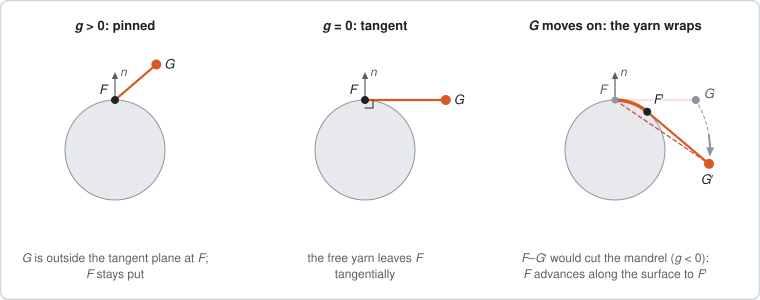

**Figure 2.** Unilateral contact, seen along the axis of a cylinder (there $n$ is radial, so the
contact state can be read off in this plane). Left: $G$ lies outside the tangent plane at $F$ and
the fell point stays. Middle: the free yarn is tangent. Right: a further motion of $G$ would make the
straight yarn cut the mandrel, so the yarn wraps and $F$ advances to the new tangency point $F'$.

Define the contact function $g=(G-F)\cdot n(F)$, the height of the guide point above the tangent
plane at $F$.

- If $g>0$, the free yarn leaves the surface outwards and $F$ stays put. This is the tie ring at
  start-up, or a lift-off.
- If $G$ moves so that $g$ would become negative, the straight yarn would cut into the mandrel. The
  yarn wraps instead: $F$ advances along the free-yarn direction $t=(G-F)/L$, $L=|G-F|$, until
  $g=0$ again.

While the yarn is being laid, $g=0$: the free yarn is tangent to the mandrel at $F$, i.e. $t$ lies in
the tangent plane $T_FS$.

### 3.3 Tangency seen along the axis

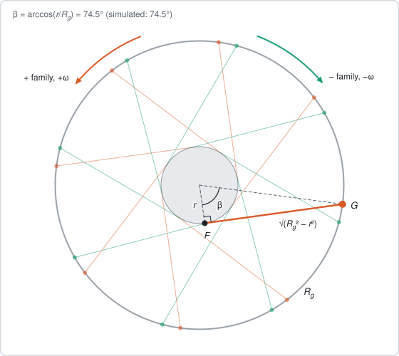

**Figure 3.** The reference case projected onto the ring plane. Every free yarn is tangent to the
mandrel circle, so the fell point lags behind its guide point by $\beta$.

On a cylinder the tangent plane at $F$ contains the axis direction. Projected along the axis it
becomes the tangent line of the circle, so the projected free yarn is tangent to the circle of
radius $r$. The right triangle centre–$F$–$G$ then gives

$$\cos\beta=\frac{r}{R_g},\qquad \lvert G-F\rvert_{\text{projected}}=\sqrt{R_g^2-r^2},$$

independently of $h$ and of the braid angle. In the reference case $\beta=74.5°$.

### 3.4 Winding kinematics: differentiating $G=F+L\,t$

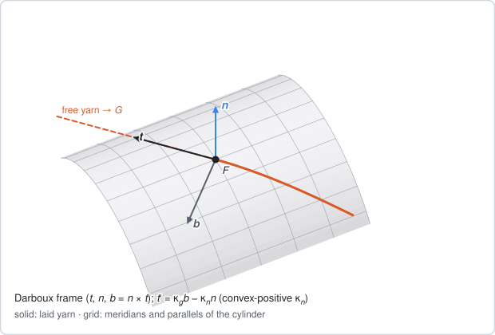

**Figure 4.** The Darboux frame $(t,n,b)$ of the laid yarn at the fell point of the reference
cylinder. The free yarn leaves $F$ along $t$, the tangent of the laid yarn.

While the yarn is wrapping, $F$ moves along the free-yarn direction, $\dot F=\lambda\,t$ with
$\lambda\ge0$. So $t$ is also the unit tangent of the laid yarn and $\lambda=ds/dt$ is the rate at
which yarn is laid (arc length per unit time). The configuration satisfies the identity
$$G=F+L\,t.$$

In the mandrel frame the free yarn is therefore the tangent line of the laid curve at its end point,
and the guide point always lies on the tangent developable of the laid yarn. If no yarn were paid out
from the bobbin (free plus laid length constant, $\dot L=-\lambda$) this would be the involute
construction, with the string winding onto the curve instead of off it. The bobbins do pay out
yarn, so in general $\dot G\cdot t\ne0$ (see below).

Differentiate the identity in time, using $\dot t=\lambda\,t'=\lambda(\kappa_g b-\kappa_n n)$:
$$\dot G=(\lambda+\dot L)\,t+\lambda L\,\kappa_g\,b-\lambda L\,\kappa_n\,n.$$

The three components of the guide point's relative velocity, in the Darboux frame at $F$, give
everything:

$$\lambda=-\frac{\dot G\cdot n}{L\,\kappa_n},\qquad \kappa_g=\frac{\dot G\cdot b}{\lambda L},\qquad \kappa_n=-\frac{\dot G\cdot n}{\lambda L},\qquad \dot L=\dot G\cdot t-\lambda,\qquad \boxed{\ \frac{\kappa_g}{\kappa_n}=-\frac{\dot G\cdot b}{\dot G\cdot n}\ }.$$

- **Normal component.** $\dot G\cdot n=-\lambda L\kappa_n$ is the time derivative of the tangency
  condition $g=0$. The yarn is laid ($\lambda>0$) when the guide point dives below the tangent plane
  ($\dot G\cdot n<0$) and the surface is convex along the yarn ($\kappa_n>0$). The $\kappa_n$ found
  here is simply the surface's normal curvature in direction $t$.
- **Binormal component.** A sideways motion of the guide point bends the laid yarn within the
  surface: it produces geodesic curvature.
- **Tangential component.** It only changes the free length.
- **Slip ratio.** The ratio $\kappa_g/\kappa_n$ depends only on the _direction_ of $\dot G$ in the
  normal plane of the yarn. It decides whether friction can hold the yarn (Section 7).

The code stores these closed forms for every sample. `tests/deposition.test.js` checks them against
finite differences of the deposited polyline.

### 3.5 Concave stretches and obstacles

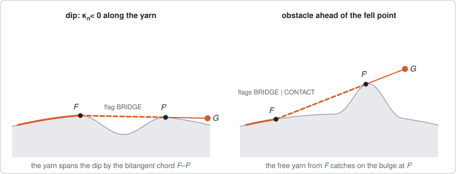

**Figure 5.** Schematic normal sections along the yarn; the chords are computed as the upper convex
hull of each section. Left: the yarn spans a dip with a bitangent chord. Right: a bulge rises into
the free yarn, which catches on it.

A yarn under tension cannot follow a stretch where $\kappa_n<0$: there the tangent line lies inside
the material, and $\lambda$ above would be negative. In a planar section, a taut string takes the
convex hull of the obstacle. The model reproduces this in two ways:

- **Concave stretch.** If $\kappa_n\le0$ along the yarn (e.g. a waist, $K<0$, see Section 5), the
  root search finds the first point ahead where the free yarn touches tangentially. The yarn in
  between is stored as a suspended straight chord, flagged BRIDGE.
- **Obstacle interference.** Independently, the whole free yarn is tested for interference with the
  mandrel, e.g. a bulge rising into it. If it cuts the surface, the yarn catches on the obstacle:
  - the fell point jumps to the tangency point near the deepest penetration;
  - the stretch from the old fell point is a straight chord, flagged BRIDGE and CONTACT;
  - this is exactly the old free segment, which is straight.
- **Validity.** The tangential lift-off idealisation is valid where $\kappa_n>0$. The chords are an
  approximation, flagged so that they are never mistaken for surface-following paths.

### 3.6 Numerical scheme

The scheme lives in `src/core/deposition.js`. Per time step, with $G\leftarrow G(t_{n+1})$, it is a
second-order Heun scheme in the chart:

1. **Predictor**: from $F_n$, move along the chart line in direction $d_n=t(F_n,G_n)$ until
   $g(\cdot;G_{n+1})=0$. This gives $F^*$.
2. **Corrector**: from $F_n$, move along $\tfrac12\bigl(d_n+t(F^*,G_{n+1})\bigr)$ until $g=0$.
   This gives $F_{n+1}$.

Each "move until $g=0$" is a bracketed root search followed by Brent's method:

- The search looks for the _first_ sign change of $g$ along the line. On convex parts it starts from
  $1.5\times$ the linear prediction $-g_0/g'(0)$, with $g'(0)=(G-F)\cdot dn/ds$. In the non-convex
  bridging mode it marches in small steps.
- It is position-based, so it never divides by $\kappa_n$.
- Tolerance: $|g|\le10^{-9}$ m.

Step size: $\Delta t=\min\bigl(\Delta\varphi_{\max}/\omega,\ \Delta s_{\max}/\sqrt{\omega^2r_{\max}^2+v^2(1+r'^2_{\max})}\bigr)$,
with defaults 0.5° and 0.5 mm. The step shrinks adaptively when the yarn direction turns more than 1°
per step.

### 3.7 On-axis reduction (independent reference)

For a centred mandrel, write $d=z_G-z_F$ with $z_G=d_0+vt$ (the ring position on the axis), and let
$\psi=\varphi_G-\theta_F$ be the lag angle. The tangency condition reads $R_g\cos\psi=r+r'd$. The
fell point moves along $G-F$. Projected onto $S_z$ and $S_\theta$, and using the tangency condition,
this gives the chart direction $(\dot z,\dot\theta)\parallel\bigl(d,\ R_g\sin\psi/r\bigr)$.
Differentiating the tangency condition in time then yields the scalar ODE
$$\dot z_F=\frac{A\left(\omega+\dfrac{r'v}{R_g\sin\psi}\right)}{1-\dfrac{r\,r''d^2}{R_g^2\sin^2\psi}},\qquad A=\frac{r\,d}{R_g\sin\psi},\qquad \theta_F=\varphi_G-\psi.$$

The denominator is proportional to $\kappa_n$. `tests/fixtures/generate_fixtures.py` integrates this
ODE with SciPy (DOP853, rtol $10^{-12}$) for a curved taper mandrel. The general 3D solver agrees
with it to $10^{-9}$ m at 0.5 mm steps, with observed order 2.

## 4. Braid angle and convergence length

### 4.1 Quasi-static braid angle

Suppose the fell point were fixed in the machine frame (constant lag $\beta$ and convergence length
$h$). Relative to the mandrel it would then rotate with the carriers and advance with the take-up:
parallel speed $\omega r$, meridian speed $v\sqrt{1+r'^2}$. Its track is the laid yarn, so
$$\tan\alpha_{qs}=\frac{\omega r}{v\sqrt{1+r'^2}}.$$

In general the fell point moves in the machine frame too. On a centred mandrel the exact relation is
$$\tan\alpha=\frac{r(\omega-\dot\beta)}{(v-\dot h)\sqrt{1+r'^2}}.$$

The quasi-static value is exact only when $\dot\beta=\dot h=0$. This is the classical
$\tan\alpha=\omega r/v$ on a cylinder (Ko 1987).

The quasi-static convergence length is the axial extent of the tangent line that leaves the surface
at angle $\alpha_{qs}$ and reaches the ring radius (a quadratic equation). On a cylinder the free
yarn $G-F$ has the component $\sqrt{R_g^2-r^2}$ along the parallel direction at $F$ (Figure 3) and
$h$ along the axis, so
$$\tan\alpha=\frac{\sqrt{R_g^2-r^2}}{h},\qquad h_\infty=\frac{\sqrt{R_g^2-r^2}}{\tan\alpha}=\frac{v\sqrt{R_g^2-r^2}}{\omega r}$$

(van Ravenhorst & Akkerman 2016).

### 4.2 The cylinder: start-up and relaxation

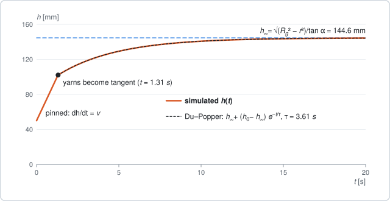

**Figure 6.** Convergence length after start-up on the reference cylinder: simulation (solid) and
the Du–Popper exponential (dashed) from the moment the yarns become tangent.

At $t=0$ every yarn is tied to the mandrel directly below its guide point, a distance $h_0$
downstream of the ring. Two phases follow.

- **Pinned.** The guide point turns away from the tie point. On a cylinder
  $g=R_g\cos\omega t-r>0$, so the fell point stays and $h=h_0+vt$ grows with the take-up.
- **Wrapping.** At $\omega t=\beta=\arccos(r/R_g)$ the free yarn becomes tangent (1.30 s in the
  reference case). From then on $\beta$ stays constant, so the fell point rotates with the carriers:
  parallel speed $\omega r$ over the mandrel. Along the yarn direction this means an axial speed
  $\omega r\cot\alpha=\omega r\,h/\sqrt{R_g^2-r^2}$ over the mandrel. Hence

$$\dot h=v-\frac{\omega r\,h}{\sqrt{R_g^2-r^2}}\quad\Rightarrow\quad h(t)=h_\infty+(h_0-h_\infty)\,e^{-t/\tau},\qquad \tau=\frac{\sqrt{R_g^2-r^2}}{\omega r},$$

with $t$ and $h_0$ now counted from the onset of wrapping. This is the transient of Du & Popper
(1994). The applet plots this reference together with the simulated $h(t)$.

### 4.3 Changing radius: the braid lags

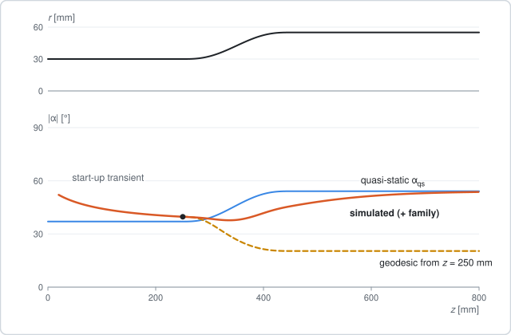

**Figure 7.** The applet's default taper (radius 30 → 55 mm between $z=250$ and $450$ mm, 32
carriers, 6 rpm, 25 mm/s). Top: profile. Bottom: simulated braid angle of the "+" yarns, the
quasi-static value, and the geodesic that leaves the braided yarn at $z=250$ mm.

The fell point cannot follow a change of radius instantly: the convergence zone has to reshape
first. Near steady state the fell point advances over the mandrel at about $v$, so on a cylinder the
relaxation of Section 4.2 has the decay length
$$v\tau=h_\infty.$$

The braid thus adapts to a new radius over roughly one convergence length. On the default taper
$h_\infty$ is 195 mm at $r=30$ mm and 101 mm at $r=55$ mm. In Figure 7 the braid angle trails the
quasi-static value by up to 11° (at $z\approx393$ mm). Behind the transition the gap shrinks by a
factor $e$ every 110–125 mm, close to $h_\infty$. At the start of the run the same relaxation
appears as a start-up transient. A geodesic leaving the same point turns the other way (Section 6).

## 5. Curvature seen by a yarn

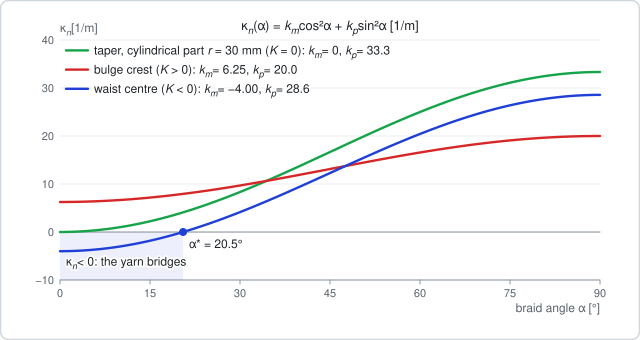

**Figure 8.** Euler's formula at three points of the default mandrels: the taper's cylindrical part
($K=0$), the bulge crest ($K>0$) and the waist centre ($K<0$). On the waist a yarn laid at less than
$\alpha^*$ would have $\kappa_n<0$ and bridges.

The principal directions of a surface of revolution are the meridian ($k_m$) and the parallel
($k_p$). A yarn at braid angle $\alpha$ therefore feels the normal curvature
$$\kappa_n(\alpha)=k_m\cos^2\alpha+k_p\sin^2\alpha.$$

The sign of $K$ decides what can happen:

- **Parabolic points** ($K=0$: cylinder, cone). $k_m=0$ and $k_p=1/(r\sqrt{1+r'^2})$, so
  $\kappa_n=k_p\sin^2\alpha\ge0$. On a cylinder $\kappa_n=\sin^2\alpha/r$.
- **Elliptic points** ($K>0$: bulge crest). Since $k_p>0$ on a surface of revolution, both principal
  curvatures are positive and every direction is convex.
- **Hyperbolic points** ($K<0$: waist). $k_m<0<k_p$, and $\kappa_n<0$ for
  $$\tan^2\alpha<-\frac{k_m}{k_p},\qquad\text{i.e.}\qquad \alpha<\alpha^*=\arctan\sqrt{-k_m/k_p}.$$
  Low-angle yarns cannot lie on a waist: they bridge (Section 3.5). On the default hourglass
  $\alpha^*=20.5°$.

The pressure of a yarn on the mandrel is proportional to $\kappa_n$ (Section 7), so the same plot
also shows how hard the yarn presses.

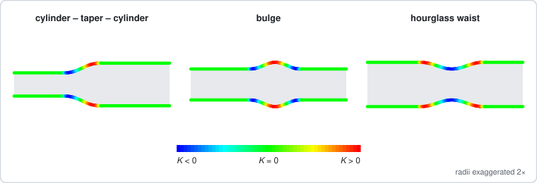

**Figure 9.** Gaussian curvature of the default mandrels in the applet's curvature map. Every
smooth transition between two radii contains both signs of $K$: concave where $r''>0$, convex where
$r''<0$.

The applet colours the mandrel by $K$ or $H$ (and the yarns by $\kappa_n$ or $\kappa_g$) with the
blue–green–red curvature map of geo-framework: green is zero, negative values run to blue and
positive ones to red, each sign scaled by its own extent.

## 6. Geodesics, and why braided yarns are not geodesics

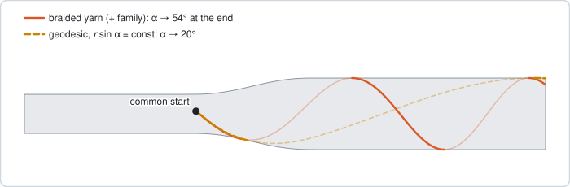

**Figure 10.** Side view of the default taper (front half solid, back half faint). From a common
point and direction the braided yarn keeps winding while the geodesic straightens out.

A tensioned yarn on a _frictionless_ mandrel would follow a geodesic. In the chart $(z,\theta)$,
with arc length $s$:
$$z''+\Gamma^z_{zz}z'^2+\Gamma^z_{\theta\theta}\theta'^2=0,\qquad \theta''+2\Gamma^\theta_{z\theta}z'\theta'=0,$$

$$\Gamma^z_{zz}=\frac{r'r''}{1+r'^2},\qquad \Gamma^z_{\theta\theta}=-\frac{r\,r'}{1+r'^2},\qquad \Gamma^\theta_{z\theta}=\frac{r'}{r}.$$

Clairaut's relation $r^2\theta'=r\sin\alpha=c$ is a first integral. Along a geodesic
$\alpha_{geo}(z)=\arcsin(c/r(z))$, until the turning point $r=c$. `src/core/geodesic.js` integrates
the ODE with RK4. The tests check the conservation of $c$ ($10^{-8}$ on analytic profiles,
$10^{-6}$ on splines) and planarity of great circles on a sphere zone.

A helix on a cylinder is a geodesic, so a steady braid on a cylinder has $\kappa_g=0$. Where the
radius grows, however, the two disagree in sign:

- the machine imposes $\tan\alpha\approx\omega r/v$, which **increases** with $r$ (Section 4.1);
- a geodesic keeps $r\sin\alpha$ constant, so its angle **decreases** with $r$.

On the default taper the geodesic from $z=250$ mm ends at $\alpha\approx20°$, the braid at 54°. The
difference is geodesic curvature, which friction has to supply. The applet draws the geodesic that
leaves the selected fell point in the yarn's current direction.

## 7. Mechanics: pressure and slip

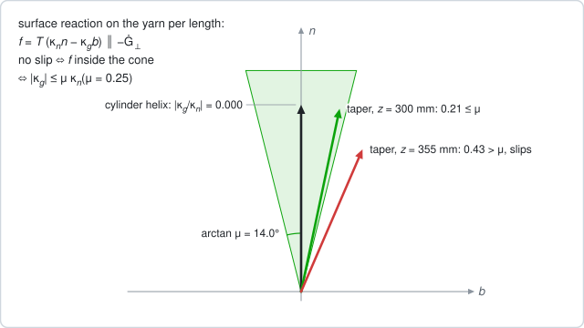

**Figure 11.** The no-slip condition as a friction cone in the $(b,n)$ plane. Computed samples: the
steady helix on the reference cylinder (on the axis of the cone), and two points of the default
taper, one inside and one outside the cone.

A flexible yarn with tension $T(s)$ is loaded by the surface with a force per unit length
$f=f_n n+f_b b+f_t t$. Equilibrium $\frac{d}{ds}(T\,t)+f=0$ with $t'=\kappa_gb-\kappa_nn$ gives
$$f_n=T\kappa_n,\qquad f_b=-T\kappa_g,\qquad f_t=-T'.$$

- **Pressure.** The normal line load is $p=T\kappa_n$. It must be positive (compression), which
  again requires $\kappa_n>0$.
- **Slip.** With Coulomb friction and constant tension the yarn does not slip sideways iff
  $$|\kappa_g|\le\mu\,\kappa_n$$
  (Akkerman & Villa Rodríguez 2007). In filament winding the ratio $\kappa_g/\kappa_n$ is called
  the slippage coefficient (Wang et al. 2011).

**Geometric reading.** The reaction $f=T(\kappa_n n-\kappa_g b)$ lies in the normal plane of the
yarn. No slip means that it lies inside the Coulomb cone of half-angle $\arctan\mu$ about $n$. By
Section 3.4,
$$\kappa_n\,n-\kappa_g\,b=-\frac{1}{\lambda L}\,\dot G_\perp,\qquad \dot G_\perp=(\dot G\cdot n)\,n+(\dot G\cdot b)\,b.$$

So the reaction is parallel to $-\dot G_\perp$. The yarn holds exactly when the guide point's
relative velocity, projected onto the normal plane of the yarn, points into the mandrel steeply
enough: within $\arctan\mu$ of $-n$.

On the default taper ($\mu=0.25$, cone half-angle 14°) friction cannot hold the braid on the middle
of the transition, $307\le z\le406$ mm; the worst sample, at $z\approx355$ mm, has
$|\kappa_g/\kappa_n|=0.43$. Samples violating the criterion are flagged SLIP; the model does not let
them slide.

## 8. Braid structure

### 8.1 Horn gears and passings

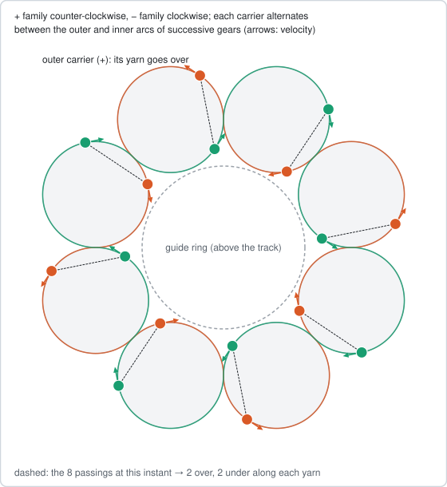

**Figure 12.** The horn-gear track of a 16-carrier regular (2/2) machine, computed from the machine
model at an instant when every "+" carrier passes a "−" carrier. The two carriers of each passing
run on opposite arcs of the same gear.

In pattern $m/m$ (diamond $m=1$, regular $m=2$, Hercules $m=3$):

- There are $N/m$ gears. Gear $q$ covers the azimuths $[q\Delta_g,(q+1)\Delta_g)$, where
  $\Delta_g=2\pi m/N$. Its centre is $c_q=\Delta_g(q+\frac12)$ and its side sign is $\sigma_q=(-1)^q$.
- A "+" carrier runs on the outer arc of gear $q$ when $\sigma_q=+1$. A "−" carrier does the
  opposite. The yarn of the outer carrier goes **over**.
- Adjacent gears touch at the azimuths $\frac{2\pi}{N}mq$. These are integer multiples of
  $2\pi/N$, so they never coincide with the passing points (half-integer multiples). Consequences:
  - carriers cannot collide at a tangency point;
  - every passing happens strictly inside one gear, with the two carriers on opposite sides.
- Each gear contains $m$ passing points, so every yarn goes over $m$ and under $m$ crossings.
- The sides alternate around the circle, so the number of gears $N/m$ must be even: $2m\mid N$.
- The visual track uses the pitch circles of radius $R_h=R_t\sin(\pi m/N)$ (adjacent gears touch).
  Carriers follow the outer or inner arc from one tangency point to the next. This gives the
  figure-eight path.
- Triaxial braids feed one stationary axial yarn through each gear centre. A bias carrier passes it
  on its own side of the gear, so it lies over the axial yarn iff it runs on the outer arc there.

### 8.2 Interlacing patterns

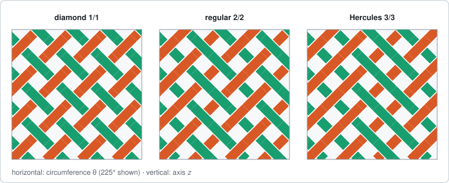

**Figure 13.** Part of the unrolled mandrel at $\alpha=45°$ for 12 carriers. The over/under of every
crossing is computed from the gear sides of Section 8.1.

On a centred mandrel the crossing of $(+j,-i)$ lies at the azimuth
$\theta_c=(i+j)\Delta/2+\Delta/4+\pi p$, a passing azimuth: by mirror symmetry both families
reach each axial position at the same time with opposite lags, and the lags cancel. Consecutive
crossings along a yarn are $2\pi/N$ apart, so $m$ consecutive crossings fall into one gear and share
its side. This gives the $m$-over-$m$-under blocks of the diamond, regular and Hercules braids.

### 8.3 Crossing detection, over/under and undulation

**Detecting crossings.** Crossings are found in the $(z,\theta)$ chart of the mandrel with a
spatial hash (`src/core/crossings.js`). Segment parameters are half-open, so vertex hits count once.

**Over/under.** The pair $(+j,-i)$ crossing at time $t_c$ uses the carrier sides at the pair's most
recent passing:

- the passing times are $t_p=((i-j)\Delta+\Delta/2+2\pi p)/(2\omega)$;
- the lag between passing and crossing is below $\pi/\omega$, because the fell-point lag angle is
  $<90°$;
- so the latest passing is unambiguous. This holds off-axis and in transients.
- On a centred mandrel, crossings occur at the passing azimuths, so the sign equals the closed-form
  rule "gear side at the crossing azimuth". The tests check this for all three patterns.

**Height.** Each yarn stores its crossing events $(s_k,\sigma_k)$. The rendered centre line lies at
height $t_y(c+a\,\tilde\sigma(s))$ above the surface, where:

- $\tilde\sigma=\sigma_k$ exactly at crossings, so the two yarns there always get opposite heights;
- between crossings of different sign, $\tilde\sigma$ follows a half-cosine blend;
- biaxial: $c=1,\ a=\frac12$; triaxial: $c=1.5,\ a=1$ with the axial yarns at $1.5$.

Laid yarns are drawn either as lines, like the free yarns, where the upper yarn is drawn on top by
depth, or as flat tapes of width $w$. Flat tapes of almost jammed braids may clip slightly near
side changes.

## 9. Coverage and jamming

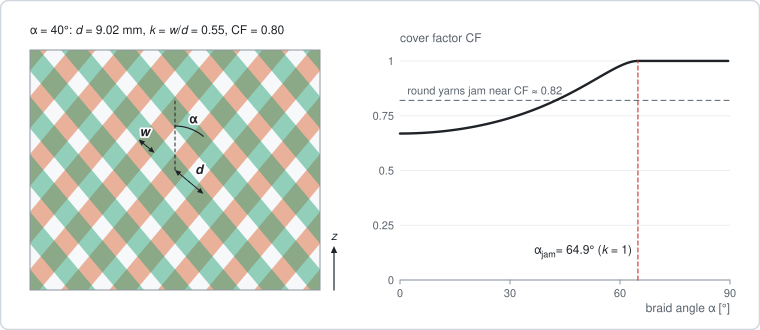

**Figure 14.** Left: a patch of the unrolled braid of the default taper at $r=30$ mm and
$\alpha=40°$. Right: cover factor versus braid angle for the same yarns, with the jamming angle.

With $N/2$ yarns per direction of width $w$, adjacent parallel yarns are $2\pi r/(N/2)$ apart along
a parallel. That is $d=\frac{4\pi r}{N}\cos\alpha$ perpendicular to the yarns. Each family covers
the fraction $k=w/d$ of the surface, and a point stays uncovered only if both families miss it:
$$k=\frac{Nw}{4\pi r\cos\alpha},\qquad CF=1-(1-k)^2\ (k\le1),\qquad \alpha_{jam}=\arccos\frac{Nw}{4\pi r}.$$

With $n_a$ axial yarns of width $w_a$: $k_a=n_aw_a/(2\pi r)$ and $CF=1-(1-k)^2(1-k_a)$.

- At $k=1$ the yarns of one family touch, and the braid cannot tighten further: it jams. Larger
  braid angles bring the yarns of a family closer together ($d\propto\cos\alpha$).
- If $Nw/(4\pi r)\ge1$ the braid is jammed at every angle.
- This is the flat-strip ideal. Round yarns jam earlier (max $CF\approx0.82$, Zhang et al. 1997).
- The model flags JAM but does not include yarn–yarn contact.

## 10. Validation

`deno task test` checks the core against:

| Check                                                                                                    | Result                                   |
| -------------------------------------------------------------------------------------------------------- | ---------------------------------------- |
| Cylinder steady state: $\alpha\to\arctan(\omega r/v)$, $h\to\sqrt{R_g^2-r^2}/\tan\alpha$, $\kappa_g\to0$ | rel. error < $10^{-4}$                   |
| Cylinder transient vs Du & Popper exponential                                                            | max error < $10^{-5}$ m                  |
| Curved taper vs SciPy solution of the on-axis ODE (Section 3.7)                                          | $10^{-9}$ m at 0.5 mm steps; order 2     |
| Closed-form $\kappa_n,\kappa_g$ vs finite differences of the deposited path (cone)                       | 0.2 %                                    |
| General (per-yarn) solver vs symmetric solver; mirror symmetry of the two families                       | < $10^{-8}$ m                            |
| Sphere zone: $\kappa_n=1/\rho$ in every direction, $K=1/\rho^2$                                          | $10^{-12}$                               |
| Clairaut invariant along geodesics                                                                       | $10^{-8}$ (analytic), $10^{-6}$ (spline) |
| Passings on opposite sides, no carrier collisions, $m/m$ blocks along every yarn                         | exact                                    |
| Crossing signs vs the gear-side rule; one yarn on top per crossing                                       | exact                                    |

## 11. Limitations

- **Yarns:** flexible and inextensible, with constant tension and width (no flattening, no bending
  stiffness).
- **Free yarn:** straight from an idealised guide point. There is no friction before contact and no
  yarn–yarn interaction in the convergence zone. Real inter-yarn friction shortens $h$ by about
  25 % for 144 carriers (van Ravenhorst & Akkerman 2016).
- **Contact:**
  - deposited yarn sticks;
  - slip is flagged, not simulated;
  - concave stretches and obstacles are bridged by straight chords.
- **Machine:** uniform carrier rotation; horn-gear speed variations are ignored.
- **Mandrel:** a surface of revolution $r(z)$ (optionally offset or tilted), so domes and poles
  ($r\to0$) are not representable.

## About the figures

`tools/figures/make.js` generates every figure as SVG in `docs/figures/`, using the applet's own
core modules. Simulation figures come from actual runs (the reference cylinder, run to $t=25$ s, and
the default taper, run to the end); curvature, geodesic, track, pattern and cover figures evaluate
the same functions the applet uses. Figures 0 and 5 are schematic. Run `deno task figures` after a
change to the core; `tests/figures.test.js` fails when a committed figure is out of date. The
in-app Theory tab shows the same files.

## References

- Akkerman R., Villa Rodríguez B.H. (2007). Braiding simulation and slip evaluation for arbitrary
  mandrels. _AIP Conf. Proc._ 907, 1074–1079. doi:10.1063/1.2729657
- do Carmo M.P. (1976). _Differential Geometry of Curves and Surfaces_, §4-4.
- Du G.-W., Popper P. (1994). Analysis of a circular braiding process for complex shapes.
  _J. Textile Institute_ 85(3), 316–337. doi:10.1080/00405009408631277
- Kessels J.F.A., Akkerman R. (2002). Prediction of the yarn trajectories on complex braided
  preforms. _Composites Part A_ 33, 1073–1081. doi:10.1016/S1359-835X(02)00075-1
- Ko F.K. (1987). Braiding. In: _Engineered Materials Handbook_, Vol. 1: Composites. ASM
  International, 519–528.
- van Ravenhorst J.H., Akkerman R. (2014). Circular braiding take-up speed generation using inverse
  kinematics. _Composites Part A_ 64, 147–158. doi:10.1016/j.compositesa.2014.04.020
- van Ravenhorst J.H., Akkerman R. (2016). A yarn interaction model for circular braiding.
  _Composites Part A_ 81, 254–263. doi:10.1016/j.compositesa.2015.11.026
- Wang R., Jiao W., Liu W., Yang F., He X. (2011). Slippage coefficient measurement for
  non-geodesic filament-winding process. _Composites Part A_ 42(3), 303–309.
  doi:10.1016/j.compositesa.2010.12.002
- Zhang Q., Beale D., Adanur S., Broughton R.M., Walker R.P. (1997). Structural analysis of a
  two-dimensional braided fabric. _J. Textile Institute_ 88(1), 41–52.
  doi:10.1080/00405009708658528
